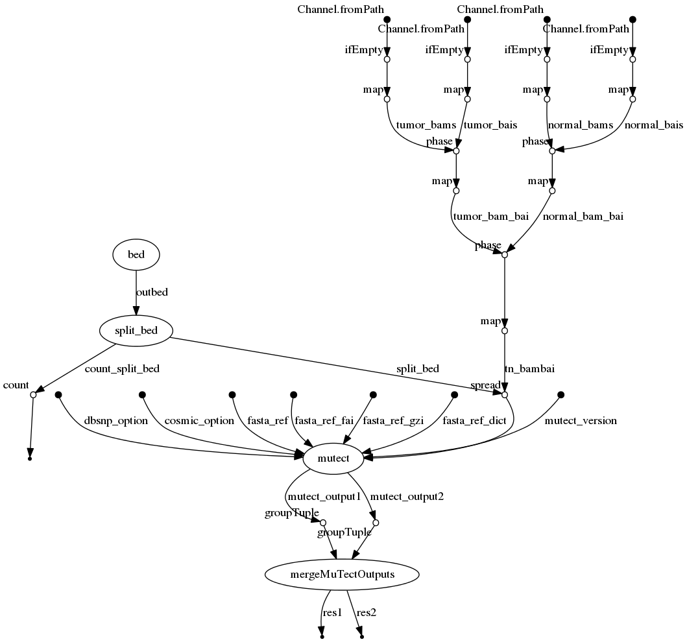

# mutect-nf
## Mutect pipeline for somatic variant calling with Nextflow
[](https://circleci.com/gh/nalcala/mutect-nf/tree/master)
[](https://hub.docker.com/r/nalcala/mutect-nf/)
[](https://singularity-hub.org/collections/4333)


## Description
Nextflow pipeline for somatic variant calling with mutect with Mutect1 or 2, gatk3 or gatk4

## Dependencies
1. Nextflow: for common installation procedures see the [IARC-nf](https://github.com/IARCbioinfo/IARC-nf) repository.
2. [Mutect](https://github.com/broadinstitute/mutect) and its dependencies (Java 1.7 and Maven 3.0+), or [gatk4](https://github.com/broadinstitute/gatk) that now includes Mutect2
3. [bedtools](http://bedtools.readthedocs.io/en/latest/content/installation.html) and move the executable file in your path.
4. [python](https://www.python.org/) and package [pysam](https://github.com/pysam-developers/pysam)
5. [bedops](https://github.com/bedops/bedops)

**A conda receipe, and docker and singularity containers are available with all the tools needed to run the pipeline (see "Usage")**

### GATK4
With GATK4, a list of known_snps can be provided to mutect2 to improve the variant classification, for example file [af-only-gnomad.hg38.vcf.gz](https://console.cloud.google.com/storage/browser/_details/gatk-best-practices/somatic-hg38/af-only-gnomad.hg38.vcf.gz) from the bundle best practices from the broad institute [GATK somatic calling bundle](https://console.cloud.google.com/storage/browser/gatk-best-practices/somatic-hg38/).

### estimate contamination
When the estimate contamination mode is chosen, one needs to provide a list of known snps; we recommend the file [small_exac_common_3.hg38.vcf.gz](https://console.cloud.google.com/storage/browser/_details/gatk-best-practices/somatic-hg38/small_exac_common_3.hg38.vcf.gz) from the best practices broad institute bundle.

## Input 
 | Type      | Description     |
  |-----------|---------------|
  |--tumor_bam_folder | a folder with tumor bam files |
  |--normal_bam_folder | a folder with normal bam files |
  |--tn_file |  input tabulation-separated values file with columns sample (sample name), tumor (full path to tumor bam), normal (full path to matched normal bam); optionally (for --genotype mode), columns preproc (is the bam RNAseq needing preprocessing: yes or no) and vcf (full path to vcf file containing alleles to genotype) |
  
 ### Input methods
 Note that there are two input methods: separate tumor_bam_folder and normal_bam_folder, and tn_file. 
 
#### Separated tumor_bam_folder and normal_bam_folder method 
The method assumes that normal and tumor bam files are in these respective folder, and uses parameters suffix_tumor and suffix_normal to detect them (the rest of the file name needs to be identical. 
  
The tumor bam file format must be (`sample` `suffix_tumor` `.bam`) with `suffix_tumor` as `_T` by default and customizable in input (`--suffix_tumor`). (e.g. `sample1_T.bam`)
The normal bam file format must be (`sample` `suffix_normal` `.bam`) with `suffix_normal` as `_N` by default and customizable in input (`--suffix_normal`). (e.g. `sample1_N.bam`).
BAI indexes have to be present in the same location than their BAM mates, with the extension `bam.bai`.

#### The tn_file method 
The method uses a tabulation-separated values format file with columns sample, tumor, and normal (in any order); it does not use parameters suffix_tumor and suffix_normal and does not require file names to match. When the genotype mode is active, additional columns are expected: preproc, specifying if preprocessing of RNA-seq bam file is required (yes or no) and vcf, indicating the location of the vcf file containing the alleles to genotype. preproc includes splitting spanning reads, correcting CIGAR string with NDN pattern, and changing mapping quality of uniquely mapped reads from 255 to 60(gatk4's splitNCigarReads and a custom python script). The tn_file method is necessary for joint multi-sample calling, in which case the sample name is used to group files, and to specify preprocessing of some RNA-seq samples.

BAI indexes have to be present in the same location than their BAM mates, with the extension `bam.bai`.

## Parameters

* #### Mandatory
| Name | Example value | Description |
|-----------|--------------:|-------------| 
|--ref | ref.fa | reference genome fasta file |

* #### Optional

| Name | Default value | Description |
|-----------|--------------|-------------| 
|--cpu          | 4 | number of CPUs |
|--mem         | 8 | memory for mapping|
|--suffix_tumor      | \_T | suffix for tumor file|
|--suffix_normal      | \_N | suffix for matched normal file|
|--output_folder   | mutect_results | output folder for aligned BAMs|
|--bed   |   | Bed file containing intervals | 
|--region | |  A region defining the calling, in the format CHR:START-END |
|--known_snp |  | VCF file with known variants and frequency (e.g., from gnomad) |
|--mutect_args | | Arguments you want to pass to mutect. WARNING: form is " --force_alleles " with spaces between quotes |
|--nsplit | 1 | Split the region for calling in nsplit pieces and run in parallel |
|--java | java | Name of the JAVA command | 
|--snp_contam  | | VCF file with known germline variants to genotype for contamination estimation (requires --estimate_contamination) |
|--PON | | path to panel of normal VCF file used to filter calls |
|--gatk_version | 4 | gatk version |
|--ref_RNA | | fasta reference for preprocessing RNA (required when preproc column contains yes in input tn_file) |

NOTE: if neither --bed or --region, will perform the calling on whole genome, based on the faidx file.

* #### Optional for gatk3 
These options are not needed if gatk4 is used

| Name | Default value | Description |
|-----------|--------------|-------------| 
|--cosmic |  | Cosmic VCF file required by mutect; not in gatk4 |
|--mutect_jar | | path to jar file of mutect1 |
|--mutect2_jar | | path to jar file of mutect2 |

* #### Flags

| Name  | Description |
|-----------|-------------| 
|--help | print usage and optional parameters |
|--estimate_contamination | run extra step of estimating contamination by normal and using the results to filter calls; only for gatk4|
|--genotype | use genotyping from vcf mode instead of usual variant calling requires tn_file with vcf column and gatk4, and if RNA-seq included, requires preproc column |

## Usage
To run the pipeline on a series of matched tumor normal files (with suffixes *_T* and *_N*) in folders *tumor_BAM* *normal_BAM*, a reference genome with indexes *ref*, and a bed file ref.bed, one can type:
```bash
nextflow run nalcala/mutect-nf -r v2.0 -profile singularity  --tumor_bam_folder tumor_BAM/ --normal_bam_folder normal_BAM/ --ref ref_genome.fa --gtf ref.gtf 
``` 
To run the pipeline without singularity just remove "-profile singularity".

To use gatk3, set `--gatk_version 3`and provide option `--mutect2_jar` for mutect version 2 (GATK executable jar, which integrate mutect2), and `--mutect_jar` for mutect version 1.

#### Help section
You can print the help manual by providing `--help` in the execution command line:
```bash
nextflow run iarcbioinfo/mutect-nf --help
```
This shows details about optional and mandatory parameters provided by the user.  

## Output 
  | Type      | Description     |
  |-----------|---------------|
  | sample.vcf.gz and sample.vcf.gz.tbi   | filtered VCF files and their indexes |
  | stats/    | gatk stats files from mutect |
  | intermediate_calls/raw_calls/sample.vcf | unfiltered VCF files |
          
The output_folder directory contains two subfolders: stats and intermediate_calls


## Directed Acyclic Graph
[](http://htmlpreview.github.io/?https://github.com/IARCbioinfo/mutect-nf/blob/dev/dag.html)

## Contributions

  | Name      | Email | Description     |
  |-----------|---------------|-----------------| 
  | Nicolas Alcala*    | AlcalaN@iarc.fr    | Developer to contact for support |
  | Tiffany Delhomme |  | Developer |
